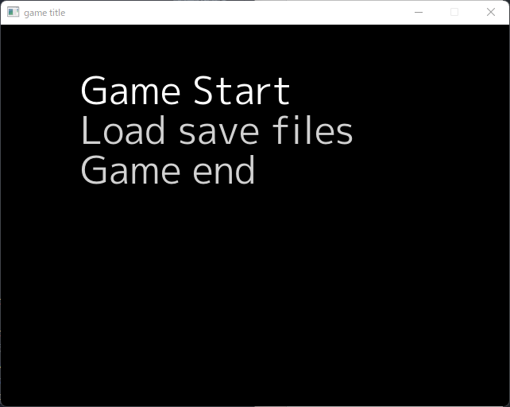

# Utilityチュートリアル
このチュートリアルでは、The Pen Game Programing Finite State MachineのUtilityを学んでいきます。      
これらは、pgfsmを活用したゲーム制作に役立つものの集合です。   

# 開発環境

```shell
>go version
go version go1.18.3 windows/amd64
```

# はじめに
[チュートリアルと同じようにプロジェクトを作成・ライブラリの導入を行ってください。](/doc/Tutorial.md#プロジェクトページの作成)

# 選択画面の作成
ゲームにおいて、矢印キーで選ぶ選択画面は必須です。    
メニューやタイトル画面等に使用されます。    
その選択画面を実装する上でベースになるのが、`SelectState`です。   
    
ここではゲームタイトル画面風のシーンを作成してみましょう。

```go
package main

import (
	"image/color"
	"log"

	"github.com/PenguinCabinet/pgfsm"
	"github.com/hajimehoshi/ebiten/v2"
	"github.com/hajimehoshi/ebiten/v2/examples/resources/fonts"
	"github.com/hajimehoshi/ebiten/v2/inpututil"
	"github.com/hajimehoshi/ebiten/v2/text"
	"golang.org/x/image/font"
	"golang.org/x/image/font/opentype"
)

func main() {
	const dpi = 72

	tt, err := opentype.Parse(fonts.MPlus1pRegular_ttf)

	if err != nil {
		panic(err)
	}

	mplusNormalFont, err := opentype.NewFace(tt, &opentype.FaceOptions{
		Size:    48,
		DPI:     dpi,
		Hinting: font.HintingFull,
	})

	if err != nil {
		panic(err)
	}
	s := &pgfsm.SelectState{
		/*初期化の処理*/
		InitFunc: func() {},

		/*一番最初の選択肢がおかれる座標*/
		OrignX: 100,
		OrignY: 100,

		/*選択肢と選択肢の間隔。この場合x座標が50ずつ選択肢を並べられる。*/
		IntervalX: 0,
		IntervalY: 50,

		/*選択肢を描写する関数。ここではテキストで描写している。*/
		DrawFuncs: []func(*ebiten.Image, int, int, bool){
			/*引数x,yは選択肢を描くべき座標が代入されている。bには現在この選択肢を選択しているかが、boolで代入されている。選択されている場合true。*/
			func(screen *ebiten.Image, x, y int, b bool) {
				//x==100,y==100
				if !b {
					text.Draw(screen, "Game Start", mplusNormalFont, x, y, color.Gray16{Y: 210 * 256})
				} else {
					text.Draw(screen, "Game Start", mplusNormalFont, x, y, color.White)
				}
			},
			func(screen *ebiten.Image, x, y int, b bool) {
				//x==100,y==150
				if !b {
					text.Draw(screen, "Load save files", mplusNormalFont, x, y, color.Gray16{Y: 210 * 256})
				} else {
					text.Draw(screen, "Load save files", mplusNormalFont, x, y, color.White)
				}
			},
			func(screen *ebiten.Image, x, y int, b bool) {
				//x==100,y==200
				if !b {
					text.Draw(screen, "Game end", mplusNormalFont, x, y, color.Gray16{Y: 210 * 256})
				} else {
					text.Draw(screen, "Game end", mplusNormalFont, x, y, color.White)
				}
			},
		},
		DecisionFunc: []func() pgfsm.Result{
			func() pgfsm.Result {
				/*Game Startを選択し、決定したときの処理*/
				return pgfsm.Result{
					Code:      pgfsm.CodeNil,
					NextState: nil,
				}
			},
			func() pgfsm.Result {
				/*Load save filesを選択し、決定したときの処理*/
				return pgfsm.Result{
					Code:      pgfsm.CodeNil,
					NextState: nil,
				}
			},
			func() pgfsm.Result {
				/*Game endを選択し、決定したときの処理*/
				return pgfsm.Result{
					Code:      pgfsm.CodeNil,
					NextState: nil,
				}
			},
		},
		CancelFunc: func() pgfsm.Result {
			/*キャンセルしたときの処理*/
			return pgfsm.Result{
				Code:      pgfsm.CodeNil,
				NextState: nil,
			}
		},
		/*選択肢が端より先に進んだり戻った時、ループするかどうか。
		ここではループを選んでいる。*/
		IsLoop: true,
		/*次の選択肢へ行くための判別関数。ここでは下矢印キーを押すと、次の選択肢を選びます。*/
		PressedNextKeyFunc: func() bool { return inpututil.IsKeyJustPressed(ebiten.KeyDown) },
		/*前の選択肢へ行くための判別関数。ここでは上矢印キーを押すと、前の選択肢を選びます。*/
		PressedBackKeyFunc: func() bool { return inpututil.IsKeyJustPressed(ebiten.KeyUp) },
		/*決定のための判別関数。ここではエンターキーを押すと、決定します。*/
		PressedDecisionKeyFunc: func() bool { return inpututil.IsKeyJustPressed(ebiten.KeyEnter) },
		/*キャンセルのための判別関数。ここではESCキーを押すと、キャンセルします。*/
		PressedCancelKeyFunc: func() bool { return inpututil.IsKeyJustPressed(ebiten.KeyEscape) },
	}
	ebiten.SetWindowSize(640, 480)
	ebiten.SetWindowTitle("game title")

	gms := &pgfsm.Machine{}

	gms.LayoutWidth = 640
	gms.LayoutHeight = 480

	gms.StateAdd(s)

	if err := ebiten.RunGame(gms); err != nil {
		log.Fatal(err)
	}
}

```



上記のプログラムは、上下の矢印キーで選択肢を選択するプログラムです。    
現在選択している選択肢は強調されるようになっており、エンターキーで決定し、ESCキーでキャンセルします。    
選択しても何も実行しません。    

